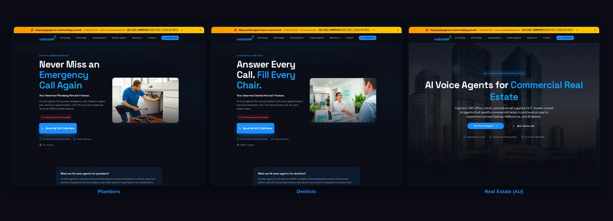
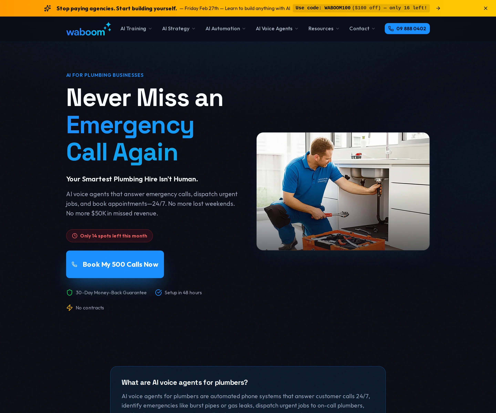
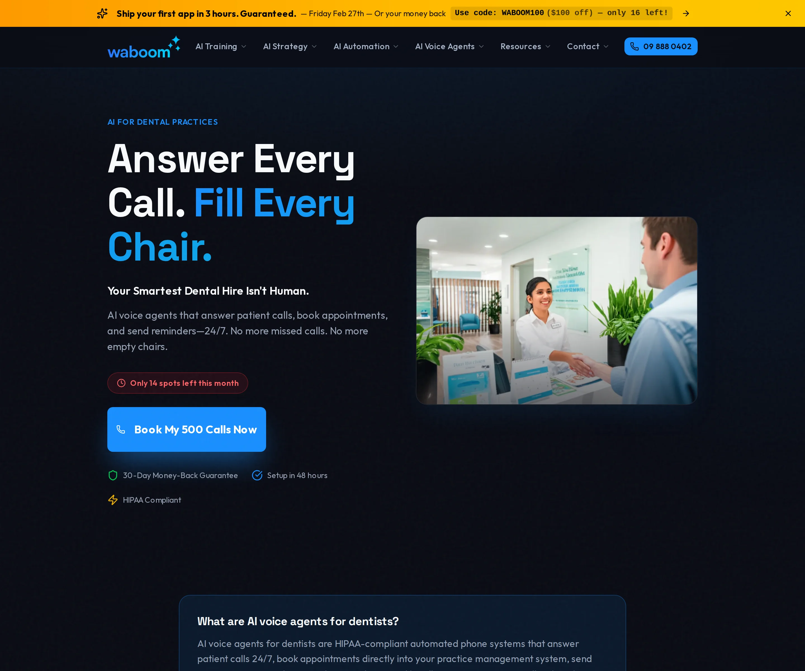

# Waboom Landing Page

A Claude Code skill that researches industries, writes conversion-focused landing pages, and optimises for SEO/AEO. Automatically.



## What This Does

One skill file. Say "Waboom landing page for [industry]" and Claude Code will:

1. **Research** the industry via web search (pain points, statistics, FAQ, competitor positioning)
2. **Write** a complete landing page (headline, problem agitation, features, FAQ, CTA)
3. **Optimise** for SEO and AEO (metadata, JSON-LD schema, FAQPage markup, keyword placement)
4. **Generate** a hero image using Gemini (optional, requires API key)

Every page is personalised to the target industry with real statistics, industry-specific language, and researched pain points.

## Features

- **Research-first workflow** - Searches Google for real industry data before writing a single word
- **SEO/AEO built in** - Auto-generates metadata, JSON-LD schema (Service + FAQPage + LocalBusiness), and optimises for AI answer engines
- **Direct, edgy voice** - Alex Hormozi-inspired writing style. No corporate fluff.
- **Brand voice consistency** - Every page follows the same tone, structure, and quality standard
- **Multi-format content** - Landing pages, blog posts, social posts, video scripts, emails
- **Image generation** - Optional hero images via Gemini (nano-banana-pro MCP server included)
- **Onboarding built in** - Say "Waboom setup" and it asks 10 questions to learn your business

## Quick Start

### 1. Install the skill

```bash
cp -r skill/ ~/.claude/skills/waboom-landing-page/
```

### 2. Set up your business details

Open Claude Code and say:

```
Waboom setup
```

The skill will ask about your company, services, stats, target market, and brand. It generates a personalised `knowledge-base.md` so every piece of content knows your business.

### 3. Generate your first landing page

```
Waboom landing page for electricians
```

Claude will research the electrical industry, write a complete landing page, optimise for SEO/AEO, and generate a hero image (if configured).

## How It Works

```
"Waboom landing page for plumbers"
          |
          v
  Phase 1: RESEARCH
  - Search: "[industry] biggest pain points"
  - Search: "[industry] statistics missed calls"
  - Search: "[industry] AI automation benefits"
  - Search: "[industry] common questions FAQ"
  - Search: "best [industry] landing page examples"
          |
          v
  Phase 2: WRITE
  - Headline with researched stats
  - Problem agitation with real pain points
  - Features that solve researched problems
  - FAQ from actual questions people ask
          |
          v
  Phase 3: SEO/AEO OPTIMISE
  - Page title, meta description
  - JSON-LD schema (Service + FAQPage + LocalBusiness)
  - Keyword placement in H1, first 100 words
  - Internal links, canonical URL, OG image prompt
          |
          v
  Phase 4: GENERATE HERO IMAGE
  - Industry-relevant visual
  - Dark background, brand colour accents
  - Professional editorial style
```

## All Commands

| Command | What It Does |
|---------|-------------|
| `Waboom landing page for [industry]` | Full 4-phase landing page |
| `Waboom page for [industry]` | Same as above |
| `Waboom setup` | Run onboarding questionnaire |
| `Waboom blog about [topic]` | Researched blog post |
| `Waboom social post for [platform]` | Platform-optimised post |
| `Waboom image for [content]` | Generate with nano-banana-pro |
| `Waboom video script for [topic]` | Hook > Problem > Solution > Offer > CTA |
| `Waboom headlines for [topic]` | 5-7 headlines with psychological hooks |
| `Waboom email for [purpose]` | Email copy |
| `Waboom ideas for [audience]` | 10 content ideas with hooks |

## Image Generation (Optional)

The skill generates hero images using Gemini via the included MCP server. This is optional. All text content works without it.

### Setup

1. Get a free API key from [Google AI Studio](https://aistudio.google.com/apikey)

2. Add the MCP server to Claude Code:

```bash
claude mcp add nano-banana-pro \
  -e GEMINI_API_KEY=your_key_here \
  -- python3 /path/to/mcp-server/nano-banana-pro.py
```

3. Install Python dependencies:

```bash
pip install -r mcp-server/requirements.txt
```

See [mcp-server/README.md](mcp-server/README.md) for detailed setup instructions.

## Skill Structure

```
skill/
  SKILL.md               # Core skill: persona, voice, workflows, rules
  knowledge-base.md      # Your business data (generated by "Waboom setup")
  content-templates.md   # Blog, social, video, email templates
  headline-formulas.md   # Psychological hooks and headline patterns
  image-guide.md         # Image generation prompts and settings
  seo-aeo-checklist.md   # SEO/AEO optimisation checklist + JSON-LD templates
```

## Examples

See the [examples/](examples/) directory for sample outputs:

- [Plumbers landing page](examples/plumbers-landing-page.md) - Full landing page with emergency triage features
- [Dentist blog post](examples/dentist-blog-post.md) - Hormozi-style blog about no-show rates
- [Social post](examples/social-post-example.md) - LinkedIn post with before/after stats

## Customisation

See [SETUP.md](SETUP.md) for detailed instructions on:

- Running the onboarding questionnaire
- Customising the voice and tone
- Adding your own content templates
- Configuring image generation

## Screenshots

Individual landing pages generated by this skill:

| Plumbers | Dentists | Real Estate (AU) |
|----------|----------|-------------------|
|  |  |  |

## Requirements

- [Claude Code](https://docs.anthropic.com/en/docs/claude-code) (CLI)
- Optional: Python 3.10+ (for image generation MCP server)
- Optional: Gemini API key (free tier available)

## License

MIT - see [LICENSE](LICENSE)

---

Made by [Waboom AI](https://waboom.ai). We build AI voice agents, run AI training workshops, and help businesses implement AI that actually works.

Want to see what this skill built? Check out our [landing pages](https://waboom.ai/ai-voice-agents/plumbers) or read the [full guide](https://waboom.ai/resources/claude-code-skills-guide).
